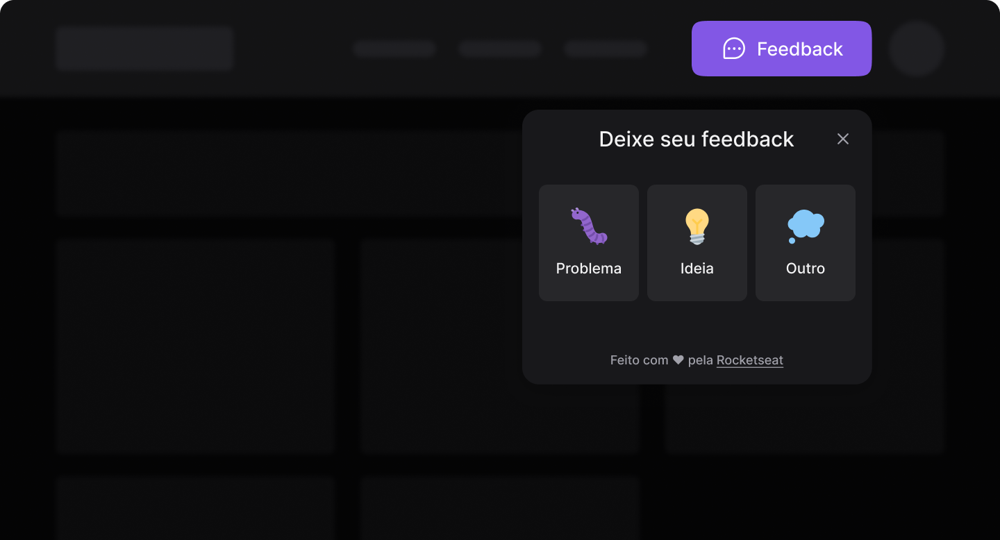

  

  <strong style="font-size: 32px;font-weight:500">Feedback Widget</strong>

  

## Sobre o projeto 🤯

Feedback Widget (ou FeedGet) é o projeto desenvolvido durante a **NLW Return**, trilha Impulse.
Ele consiste em um componente React usado em sites e aplicativos mobile para que usários possam reportar bugs, sugerir melhorias ou até mesmo dar algum feedback para a equipe de desenvolimento.

## Navegação 🧭

- [Web](https://github.com/lucascprazeres/feedback-widget/tree/main/web)
- [Mobile - ainda não funciona](https://github.com/lucascprazeres/feedback-widget/tree/main/web)
- [Back-end - ainda não funciona](https://github.com/lucascprazeres/feedback-widget/tree/main/web)

Feito com 💜 por <a href="https://www.linkedin.com/in/lucas-prazeres/">Lucas Prazeres</a>
